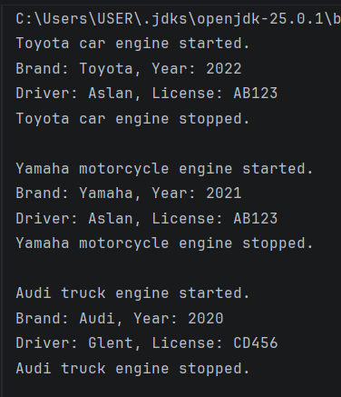

 Vehicle Management System
 A. Project Overview
This project is a Java-based application that models various vehicles and their drivers using OOP principles like inheritance and abstraction.

 B. Class Hierarchy and Encapsulation 
 Vehicle Abstract: Base class with brand and year.
 Subclasses: Car, Motorcycle, and Truck extend the base class.
 Encapsulation: I used private for specific fields and protected for shared vehicle attributes to secure data.

 C. Instructions to Compile and Run
1. Open the terminal.
2. Compile: `javac src/*.java`
3. Run: `java -cp src Main`

 D. Screenshots
 

 E. Reflection
Inheritance helped avoid code duplication by defining common fields once in the Vehicle class.
Abstraction ensured a consistent structure, forcing all vehicle types to implement start and stop methods.
Managing objects in an array demonstrated the power of polymorphism.